# Git 사용방법

##### 보는 방법
 - 모든 번호는 명령어 입력
 - 번호 밑에 - 로 시작하는 것은 각 번호의 설명
 - 빠르게 진행하고 싶으면 번호에 나오는 명령어만 봐도 가능

##### 간단한 Git 단계
 - Add
 - Commit
 - Push

### Git 초기 설정
	1. mkdir (Directory Name)
	2. cd (Directory Name)
	3. git
	 - 이 명령어는 git 관련 명령어 나열

<kbd>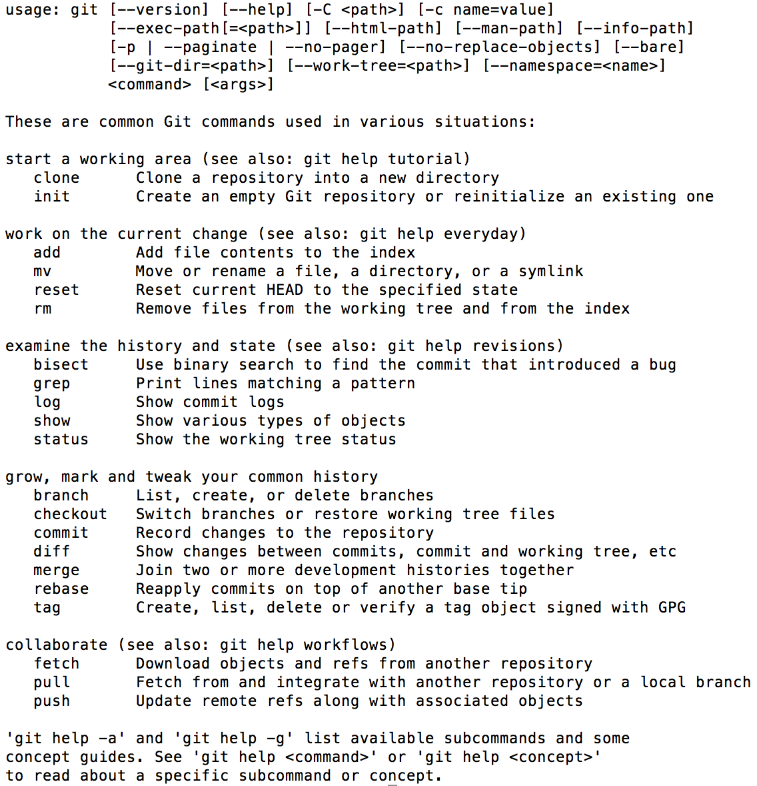</kbd>

	4. git init
	 - 현재 디렉토리를 저장소 관리하겠다는 의미
	5. ls -al
	 - .git 이라는 파일이 생긴 것을 확인 가능(여기에 파일 변경사항 저장)

<kbd>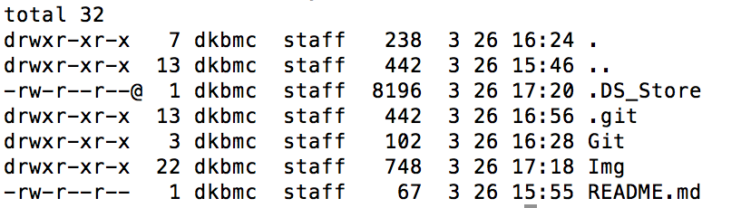</kbd>

### 파일 만들기
	6. vim (File Name)
	 - 처음 들어갔을 때 아무 것도 보이지 않습니다.

<kbd></kbd>

	7. i
	 - i 를 누르면 밑에 상태창이 -- INSERT -- 로 변경 (입력 가능한 상태)
	 - 내용 입력

<kbd>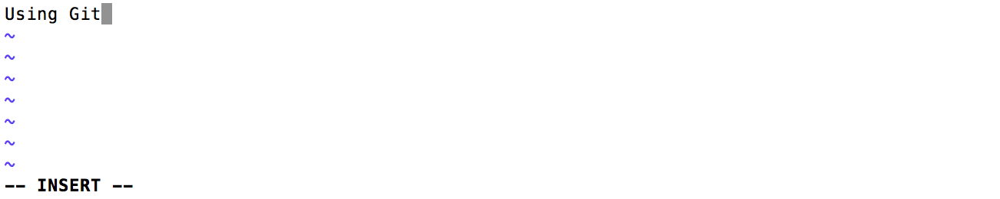</kbd>

	8. 'ESC' 키 누른 후 :wq
	 - ESC 버튼으로 입력 상태를 나오고 :wq 명령어로 파일 내용 저장 및 닫기

<kbd>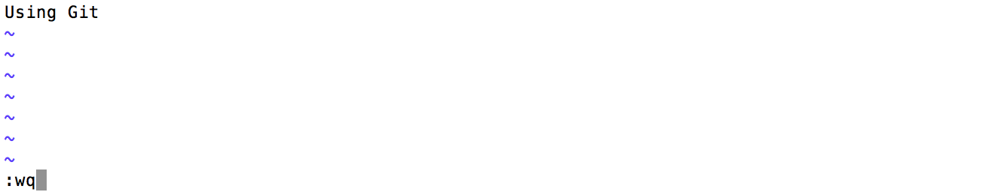</kbd>

### Git 관리 설정
	9. git status
	 - Directory 상태 물어보는 명령어
	 - Untracked files : 해당 파일이 버전관리시스템에 의해 버전관리 되고 있지 않는 상태
	 - Changes to be committed : 해당 파일의 관리만 시작했을 뿐 버전관리를 한 것은 아닌 상태(commit 전 단계)

<kbd>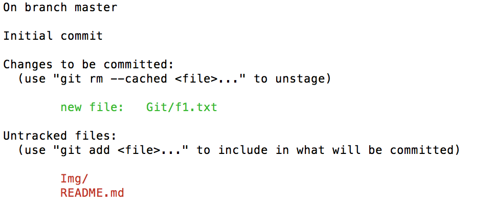</kbd>

	10. git add (File Name)
	 - 해당 파일을 관리한다는 명령어

### Git 계정 설정
	10. git config
	 - git 설정을 바꾸는 명령어 모음

<kbd>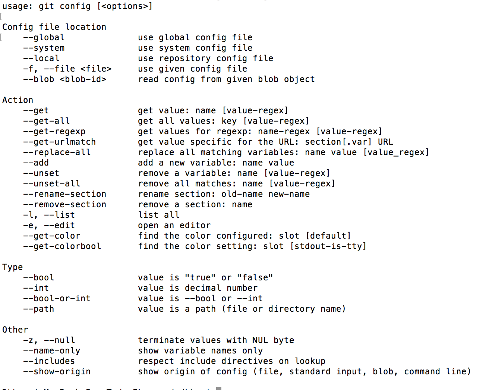</kbd>

	11. git config --global user.name "User Name"
	12. git config --global user.email "User Email"

<kbd>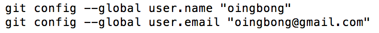</kbd>

### Git 버전 만들기
	13. git commit
	 - 파일 만들기에서 했던 7,8번 명령어 동일
	 - 여기서 입력하는 내용은 커밋내용 입니다.

<kbd>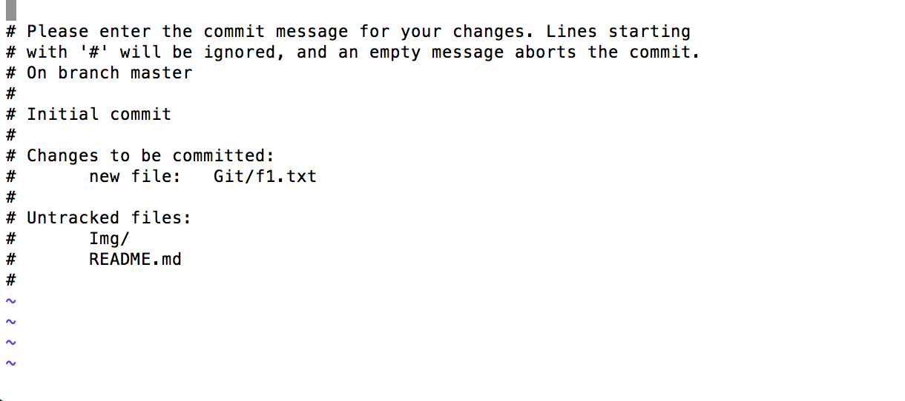</kbd>

	 - 커밋이 완료되면 다음과 같은 메세지가 나옵니다.

<kbd>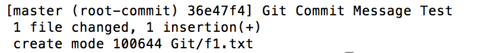</kbd>

	14. git log
	 - 지금까지 작업했던 git log 를 볼 수 있습니다.
	 - commit ~ 내용은 식별자 같은 것입니다.

<kbd>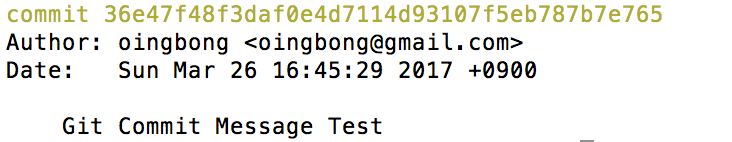</kbd>

### Github 계정 연결 및 
	15. git remote add origin https://github.com/USERNAME/REPOSITORY.git
	 - 원격 저장소 연결하기
	16. git remote -v
	 - 원격 저장소(github)에 대한 항목을 볼 수 있습니다.

<kbd>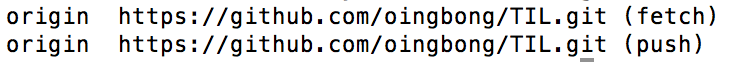</kbd>

	17. git push
	 - 이 명령어를 사용한다면 master Branch 를 설정하라는 메세지가 나옵니다.

<kbd>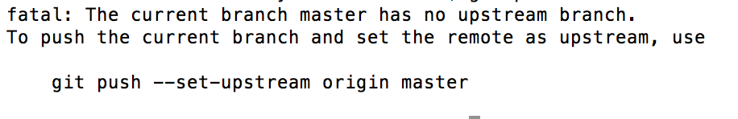</kbd>

	18. git push origin master
	 - github ID, PWD 입력
	 - 계정 확인 후 다음과 같은 메세지가 나오면 성공

<kbd>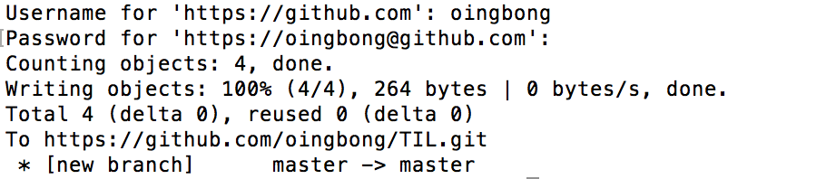</kbd>

	 - github 페이지 확인

<kbd>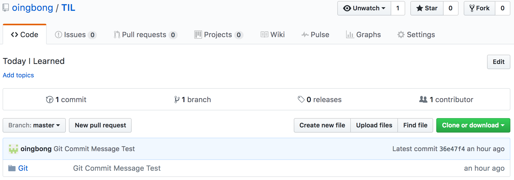</kbd>

