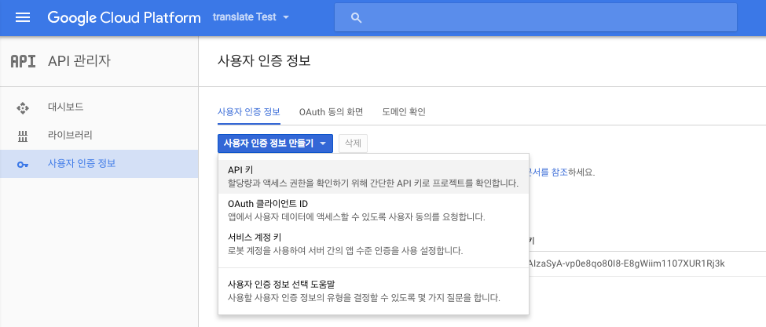
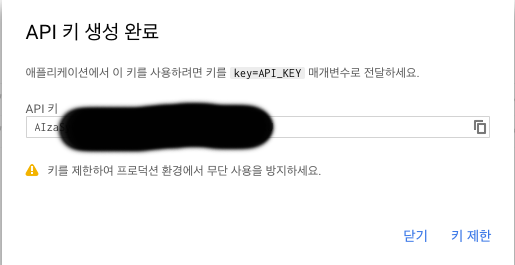
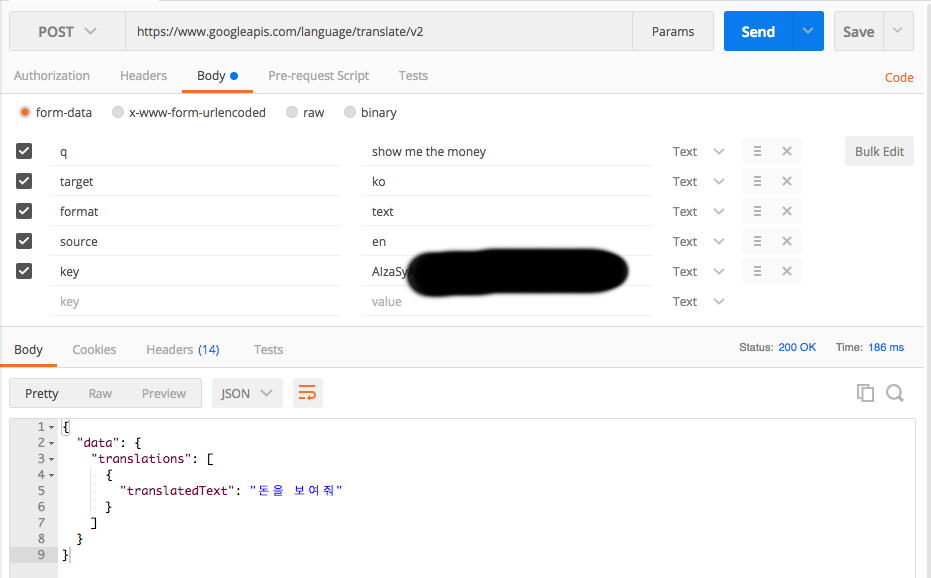

# Using Google Translate API

### 1. Google Cloud Platform Console 접속하기
	https://console.cloud.google.com/

<kbd></kbd>
    
### 2. API 키 얻기
	API 관리자 - 사용자 인증 정보 - 만들기 - API 키 Click
    
<kbd></kbd>

    아래와 같이 API 키를 얻을 수 있습니다.

<kbd></kbd>

### 3. 결제 카드 등록
	결제 - 결제 계정 등록
    
### 4. POSTMAN 으로 테스트
	- q : 번역 원하는 문장
	- target : 번역 결과 언어
	- format : text or html 선택
	- source : 번역 이전 언어 (사용하지 않으면 자동 언어 감지)
	- key : API 키
	아래와 같이 POST 방식으로 보내고 결과값을 얻기

<kbd></kbd>

